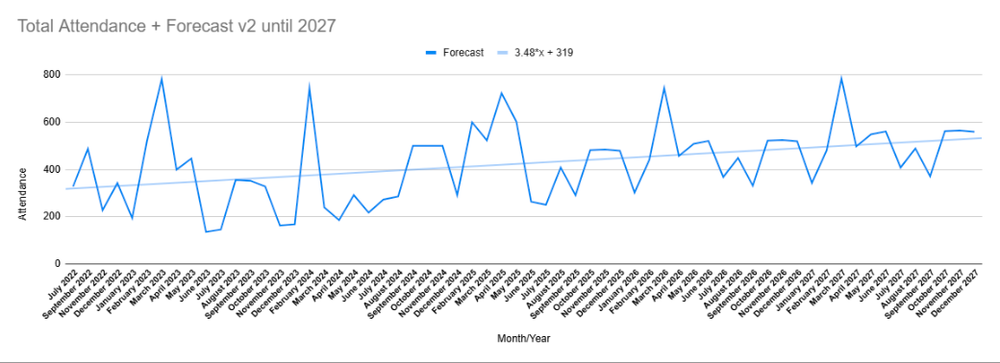

# Attendance Forecasting Model 📈

This project uses event YoY attendance data from 2022 - 2025 to forecast future attendance trends over the next 2 years (2026 & 2027) using Google Sheets.

### 📊 Tools Used
- Google Sheets (formulas, charts, and time-based analysis)
- Pivot tables & line charts
- Scalability Modelling Extensions and Apps Scripts

### 🔍 Key Features
- Month-over-month trend visualization
- Forecasting with time-based modeling
- Scalable model for future planning

### 🔗 View the Spreadsheet
[Click here to view the interactive Google Sheet](https://docs.google.com/spreadsheets/d/1rTfByHHKHlox_2DDeB88c5UCsxOA2u_KcZrdQz4PPlw/edit?usp=sharing)

### 🖼️ Previews

---

